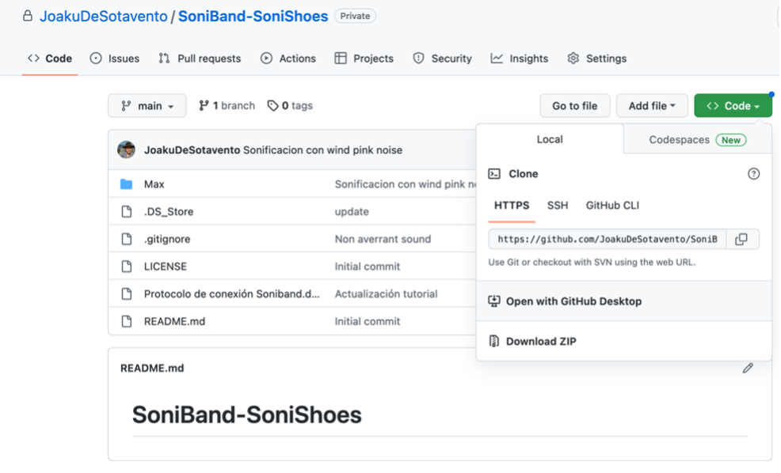
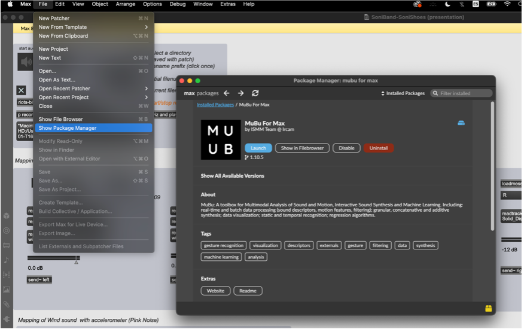
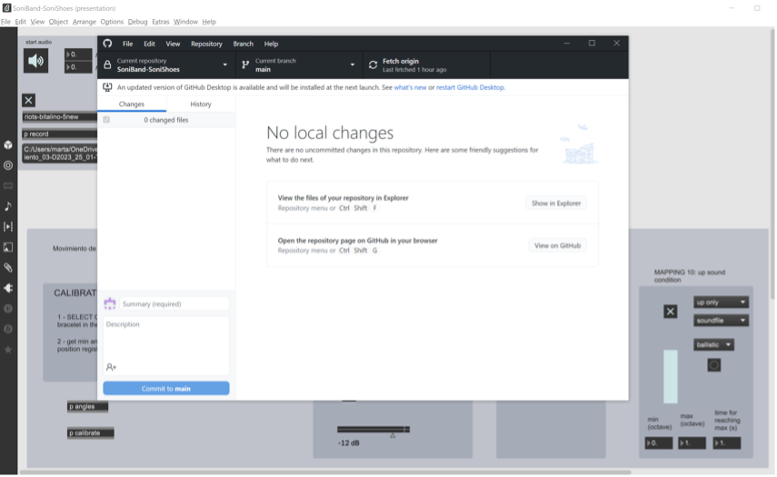
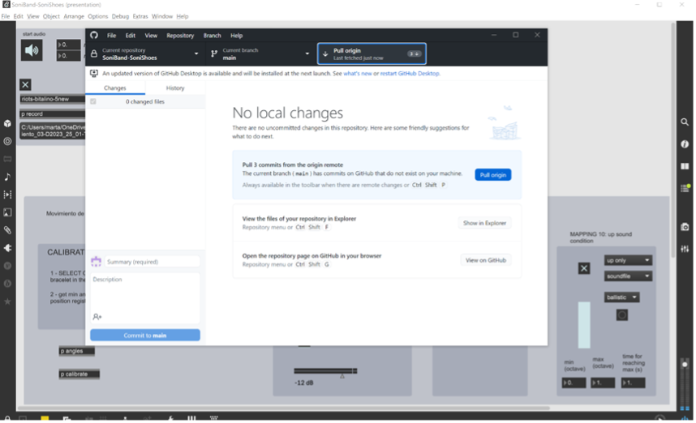
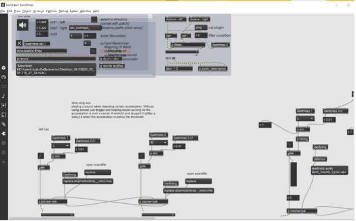
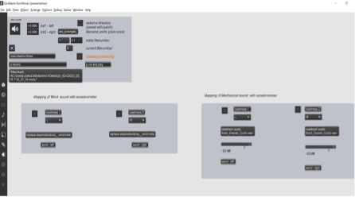
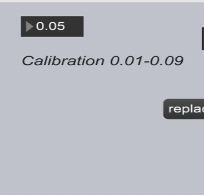
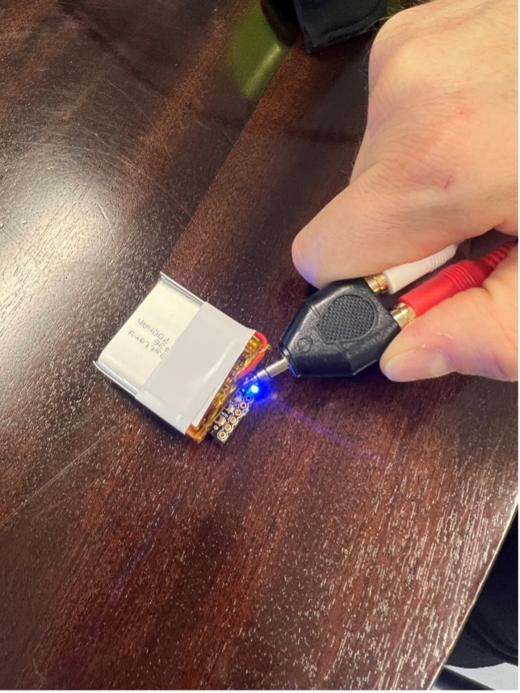
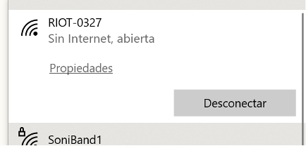
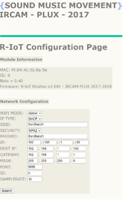

# SoniBand-SoniTouch-UCLIC
Developments in collaboration with UCLIC

# SoniBand Setup

## Previous steps

1. Download GitHub desktop <https://desktop.github.com> 
1. Create an account in GitHub <https://github.com> 
1. Clone the GitHub repository (<https://github.com/JoakuDeSotavento/SoniBand-SoniShoes>) (send a mail to the programmer to give you access) 
1. Download MAX/MSP
   1. Create an account in MAX/MSP <https://cycling74.com> 
   1. Install MAX/MSP <https://cycling74.com/downloads> 
      1. Install MUBU Package
   

## SoniBand connection protocol
1. Power the TP-Link Router
   1. WIFI: “This name X”  PSW: “Same name X”     
1. The RIoT’s should be already configured with the following date
   1. The port is the port defines what RIoT is left and right and the IP destine is the computer (with MAX software IP)
   1. ID:0	PORT:8888	IP destino:192.168.1.100
   1. ID:0	PORT:9999	IP destino:192.168.1.100
1. Goes to GitHub desktop and press Fetch origin to see if there are some updates
   1. In case there are ani update press pull!
    
     
   1. In case you did any changes press push

1. Open your project e. gr.: “C:\Users\marta\OneDrive\Documentos\GitHub\SoniBand-SoniShoes\Max\Soniband-MartaMatamala”
1. Turn-on the RIoT and check if the interface detects movement
1. Put the RIoT in the little bag placing the switch facing to the sail
1. Click presentation mode in MAX/MSP 
1. Activate the sound clicking in the speaker icon at the left corner of the graphic interface
   1. A rumor should sound when you done
1. Place the sensor with the bag aperture to the front
1. (Option) Test if the sound is not so synchronous change the calibration in between 0.01-0.09  

## Reconfigure SoniBand IP:
If needed you can reconfigure SoniBand to send the data to another IP address, follow the next steps:

1. While pressing the right button turn on one RIoT the led light should blink in red, then turns green and finally turns blue, that means the RIoT is in hotspot mode 

1. Then look for a RIOTxx among the WIFI signals
 

1. Configure the RIoT like in the following image
1. SSID should be the same as the TP-Link and the same for the PSSWD
1. In security select WPA2
1. DEST IP, should be the one you have in the TP-Link Router. Commonly 192.168.1.100  

1. Repeat for every RIoT (Sensor). The port should be with the first 8888 and with the second 9999

